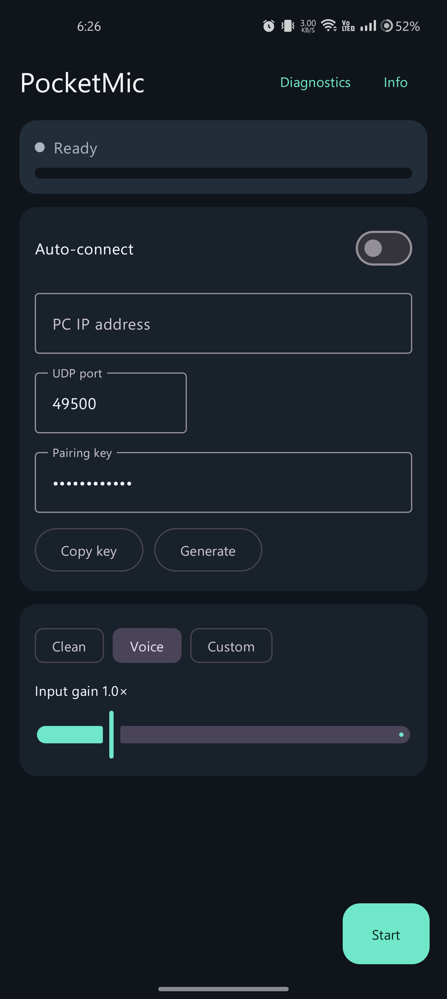
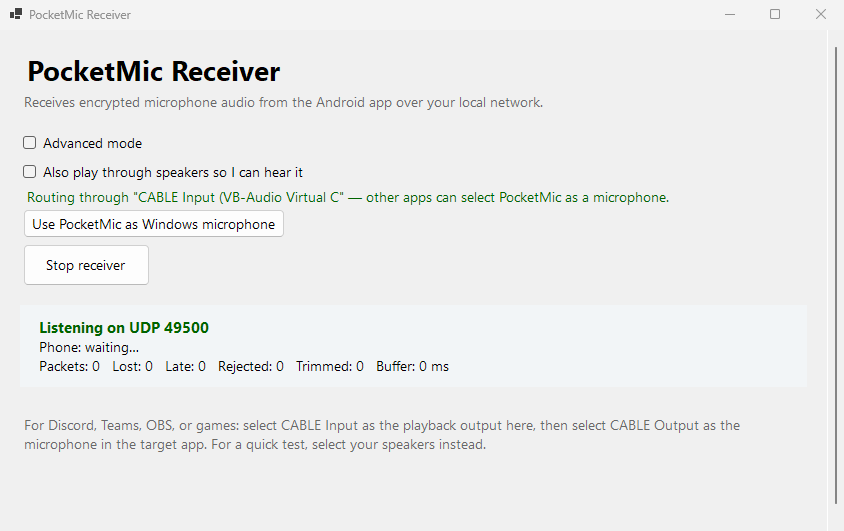

# PocketMic LAN

[](https://github.com/ryanspice/pocketmic-lan/actions/workflows/ci.yml)
[](https://github.com/ryanspice/pocketmic-lan/actions/workflows/lighthouse.yml)
[](https://github.com/ryanspice/pocketmic-lan/releases)
[](LICENSE)
[]()

**v0.1.5** · Encrypted wireless microphone for your PC

PocketMic turns an Android phone into an encrypted wireless microphone for a Windows PC on the same private LAN. 48 kHz mono PCM16, AES-256-GCM on every packet, zero cloud, zero account.

**Live site:** [canopydigital.ca/sites/pocketmic-lan/](https://canopydigital.ca/sites/pocketmic-lan/)

## Project links

- Source: <https://github.com/ryanspice/pocketmic-lan>
- Releases: <https://github.com/ryanspice/pocketmic-lan/releases>
- Android APK: <https://github.com/ryanspice/pocketmic-lan/releases/latest/download/PocketMic-v0.1.5-debug.apk>
- Windows receiver: <https://github.com/ryanspice/pocketmic-lan/releases/latest/download/PocketMicReceiver-win-x64.zip>
- Release checksums: <https://github.com/ryanspice/pocketmic-lan/releases/latest/download/SHA256SUMS.txt>
- Marketing site: <https://canopydigital.ca/sites/pocketmic-lan/>

## What is included

| Component | Stack | Description |
|-----------|-------|-------------|
| Android transmitter | Kotlin, Jetpack Compose | Foreground microphone service with QR pairing |
| Windows receiver | C#/.NET 8, WinForms, NAudio 2.3 | Audio playback with voice processing |
| Wire protocol | UDP, AES-256-GCM | 48 kHz mono PCM16, 10 ms packets, 100 pps |
| Control channel | HMAC-SHA256 | Discovery, statistics, DSP config on `audioPort + 1` |

Additional capabilities:
- QR code pairing — scan from phone, zero manual IP entry
- LAN receiver discovery with manual IPv4 fallback
- PM-LAN virtual audio cable — built-in app routing, no VB-CABLE needed
- Adaptive quality — auto-tunes bit rate and packets based on connection quality (RSSI, loss, jitter)
- Clean, voice-processed, and custom capture modes
- Adjustable input gain and live input level meter
- Selectable Windows playback device (speakers, VB-CABLE, VoiceMeeter)
- Prebuffering, bounded loss concealment, rollover-safe sequencing
- Auto-reconnect with discovery resume on link loss
- Wi-Fi lock policy (LOW_LATENCY / HIGH_PERF) fed by live network state
- Pairing key encrypted at rest on Android (EncryptedSharedPreferences)
- Session diagnostics with exportable Markdown reports
- Build, firewall, protocol, and source verification tools

## Screenshots

| Android transmitter | Windows receiver |
|:---:|:---:|
|  |  |
| Connection, QR pairing, capture modes | Device selection, voice processing, diagnostics |

Captured from v0.1.5 artifacts on a OnePlus 9 Pro and Windows 11 PC.

## Build on Windows 11

Requirements:

- Android Studio with Android SDK Platform 36
- Android Studio's bundled JBR or another JDK 17+
- .NET 8 SDK
- Python 3 (optional — verification scripts)

From the repo root:

```powershell
Set-ExecutionPolicy -Scope Process Bypass

.\scripts\build-android.ps1
.\scripts\publish-windows.ps1
```

The Android script uses the committed Gradle wrapper. Its default path runs the JVM unit tests, Android lint, and the requested APK build.

Expected outputs:

```text
release\\PocketMic-v0.1.5-debug.apk
release\PocketMicReceiver-win-x64.zip
```

Install or update the Android app:

```powershell
adb install -r .\release\PocketMic-v0.1.5-debug.apk
```

### Faster rebuilds

```powershell
.\scripts\build-android.ps1 -SkipClean                    # keep build cache
.\scripts\build-android.ps1 -SkipClean -SkipChecks        # skip tests/lint
.\scripts\build-android.ps1 -Configuration Release        # unsigned release APK
```

## How it works

1. **Start the receiver.** Run `PocketMicReceiver.exe`. It shows your IP and a pairing key.
2. **Scan the QR code.** Open PocketMic on Android, tap "Scan QR", and point at the PC screen. IP, port, and key fill in automatically. Manual entry still works as a fallback.
3. **Select the destination.** Choose speakers for a test, or `CABLE Input` for routing into Discord/Teams/OBS.
4. **Tap Start.** The phone captures at 48 kHz, encrypts every 10 ms frame with AES-256-GCM, and streams over UDP.

### Route into Discord, Teams, OBS, or a game

1. Install [PM-LAN](https://github.com/ryanspice/pocketmic-lan/releases/latest) (preferred) or [VB-Audio VB-CABLE](https://vb-audio.com/Cable/).
2. Select `PM-LAN Input` (or `CABLE Input`) in PocketMic Receiver.
3. Select `PM-LAN Output` (or `CABLE Output`) as the microphone in the target application.

The receiver has a "Use PocketMic as Windows microphone" button that repoints the system default recording device.

## Windows Firewall

Allow the selected UDP port on **Private networks** only. Default: `49500`.

```powershell
.\scripts\allow-firewall.ps1
.\scripts\allow-firewall.ps1 -Port 49501
```

## Verification

The Android build runs Kotlin/JVM tests and lint by default. The Windows build runs 74 xUnit tests. Standalone protocol checks:

```powershell
python .\tools\verify_protocol.py
python .\tools\verify_receiver_logic.py
python .\tools\verify_source.py
python .\tools\verify_web.py
```

See `PERFORMANCE_AUDIT.md` for the completed and pending verification scope.

## Performance profile

These numbers come from real-device testing on a OnePlus 9 Pro and Windows 11 PC over 5 GHz Wi-Fi:

| Metric | Value | Notes |
|--------|-------|-------|
| Prebuffer | 100 ms | Adjustable 40–300 ms on receiver |
| High-water mark | 220 ms | Buffered latency trimmed above this |
| Concealment | 200 ms | Max 20 packets of decayed-repeat fill |
| Raw bandwidth | 768 kbit/s | 48 kHz mono PCM16 |
| Packet rate | 100/s | 10 ms per packet |

Additional performance characteristics:
- Android encryption/header/packet buffers reused in the hot path
- Capture and send decoupled: bounded 8-packet drop-oldest queue
- Input meter at 10 Hz, not per packet
- Wi-Fi lock policy re-evaluated every 10 s against live network

See `PERFORMANCE_AUDIT.md` for measured jitter, loss, and the Wi-Fi lock A/B results.

## Security and network boundary

| Property | Value |
|----------|-------|
| Key | `SHA-256(UTF-8(pairing key))` |
| Cipher | AES-256-GCM |
| Nonce | Random 64-bit session ID + unsigned 32-bit sequence |
| AAD | Complete 24-byte protocol header |
| Key at rest | Android Keystore (EncryptedSharedPreferences) |
| Control channel | HMAC-SHA256, domain-separated key |
| Scope | Trusted private LAN only |

Do not port-forward the receiver. Encryption protects packet contents and integrity; it does not make this a hardened internet voice service.

## Current limits

- Windows receiver only — no macOS or Linux yet
- LAN discovery with manual IPv4 fallback and QR pairing
- PCM uses more bandwidth than Opus (~768 kbit/s)
- Fixed prebuffer with simple latency trimming, not adaptive jitter/clock recovery
- No signed Android release, Windows installer, or auto-updater
- No internet relay — both devices must be on the same LAN
- Designed for voice, not real-time music monitoring

## Project layout

```text
android/                 Kotlin Android transmitter
windows-receiver/        C# WinForms receiver UI
windows-receiver-core/   C# shared engine, audio pipeline, protocol
windows-receiver-tests/  C# xUnit tests (74 tests)
scripts/                 PowerShell build, publish, and firewall helpers
tools/                   Python protocol, logic, source, and web verification
web/                     Static marketing site (HTML/CSS/JS, zero deps)
docs/                    Project documentation
CHANGELOG.md             Version history
PROTOCOL.md              Wire format and encryption spec
PERFORMANCE_AUDIT.md     Audit findings, fixes, and measured data
```

## License

MIT

## Support

If PocketMic is useful to you, consider buying me a coffee:

[](https://www.buymeacoffee.com/ryanspice)
